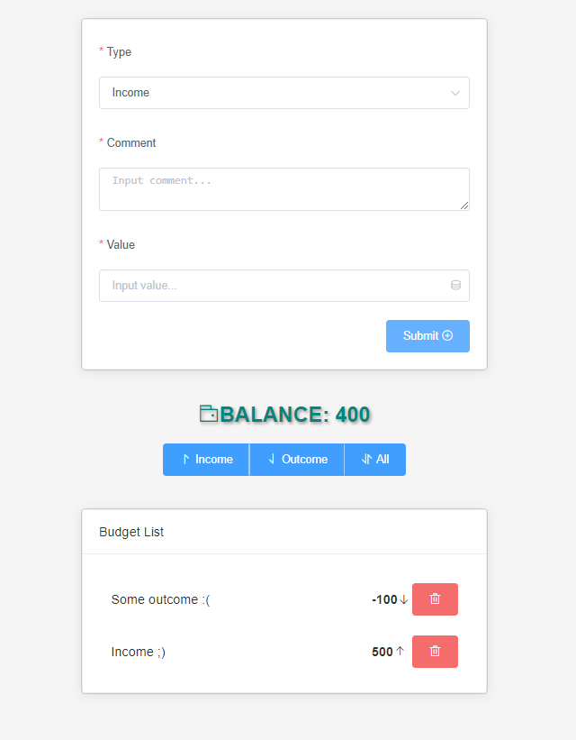

# Budget app
> Not a ToDo app

## Table of contents
* [General info](#general-info)
* [Screenshots](#screenshots)
* [Technologies](#technologies)
* [Setup](#setup)
* [Features](#features)
* [Status](#status)
* [Inspiration](#inspiration)

## General info
This is a Budget app which allows, if it does not sound strange, to calculate the budget!   
Also it has quite enough features to show:)

## Screenshots

## Technologies
* vue: 3.0.0,
* vuex: 4.0.0,
* element-plus: 1.0.2-beta.36 (UI framework)

## Setup
[DEMO](https://ic3top.github.io/Vue-path/budget-app/dist/)

## Features
List of features ready and TODOs for future development
* Adding and deleting items
* Sorting
* Form validation
* Total balance (changes colors)

To-do list:
* Improve form validation (add custom validation for comment)
* Save to local-store all items

## Status
Project is: _almost finished_

## Inspiration
My first project with vue.js and actually I LIKE this framework!
