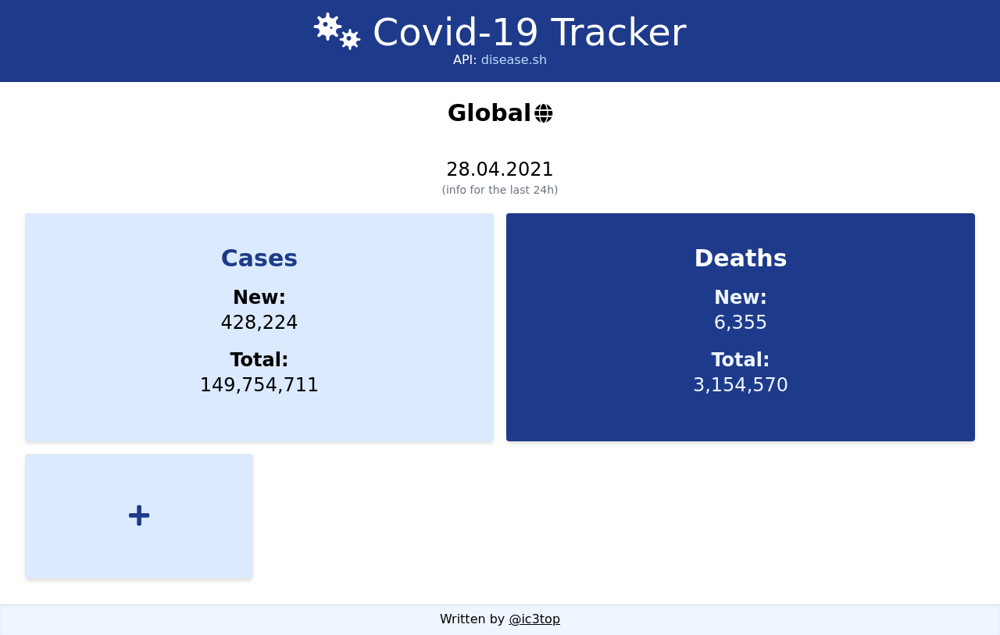

# Covid-tracker app
> Covid-19 tracker app with a wide possibility of data filtering

## Table of contents
* [General info](#general-info)
* [Technologies](#Main-technologies/dependencies)
* [Demo](#Demo)
* [Features](#features)
* [Status](#status)

## Screenshots

## General info
This is an app that allows you to see general statistics throughout the world about Covid-19, as well as add individual countries with certain statistics in the form of cards.
Also, I was using this API: [disease.sh](https://disease.sh/docs/#/);

## Main technologies/dependencies
* vue v3,
* vue router  
* tailwind v2.1.2
* moment.js (formatting data)

## Demo
[DEMO](http://vue-path-repo.site/covid-tracker/dist/)

## Features
##### List of features ready:
* See statistics around the world
* Choose certain country to see its statistic(total cases, test, etc...)
* All your chosen cards are saved into the localstorage  
* Fully adaptive
### Todos
* Implement routing

## Status
Project is: _in-progress_
