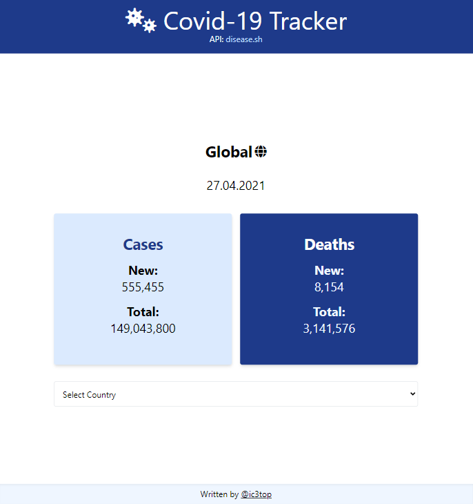

# Covid-tracker app
> Covid-19 tracker app with a wide possibility of data filtering

## Table of contents
* [General info - will be soon](#general-info)
* [Technologies](#Main-technologies/dependencies)
* [Setup](#setup)
* [Features](#features)
* [Status](#status)

## Screenshots

## Main technologies/dependencies
* vue v3,
* vue router  
* tailwind v2.1.2
* moment.js

## Setup
[DEMO](http://vue-path-repo.site/covid-tracker/dist/)

## Features
##### List of features ready:
* See statistics around the world
* Choose certain country to see its statistic
* Fully adaptive

### TODOS
* autocopmplete for countries filtering
* wider the filter possibility of the data

## Status
Project is: _in-progress_
