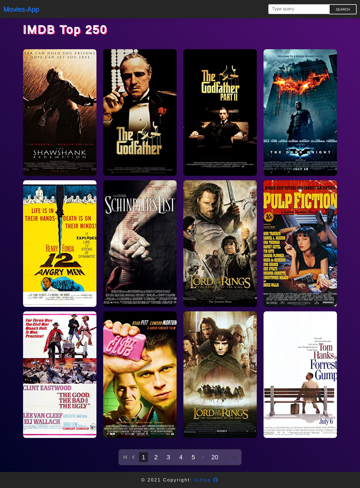

# Movies-App
> Single Page Application for surfing through movies

## Table of contents
* [General info](#general-info)
* [Technologies](#Main-technologies/dependencies)
* [Setup](#setup)
* [Features](#features)
* [Status](#status)

## General info
This is a Movies-app which allows searching for whatever movie you want. Also, it has its own 250 top movies, provides you with general info about each and a lot more features!   

## Screenshots

## Main technologies/dependencies
* vue: 3.0.0,
* vuex: 4.0.0,
* axios: 0.21.1,
* vue-router: 4.0.5 
* mdb-vue-ui-kit: 1.0.0-beta1 (Bootstrap still doesn't support Vue 3)

## Setup
[DEMO](http://vue-path-repo.site/movies/dist/)

## Features
##### List of features ready:
* Search for movies with a key word
* Delete movies (locally)  
* Top 250 movies
* Pagination
* General-info window with additional information taken from API

## Status
Project is: _finished_